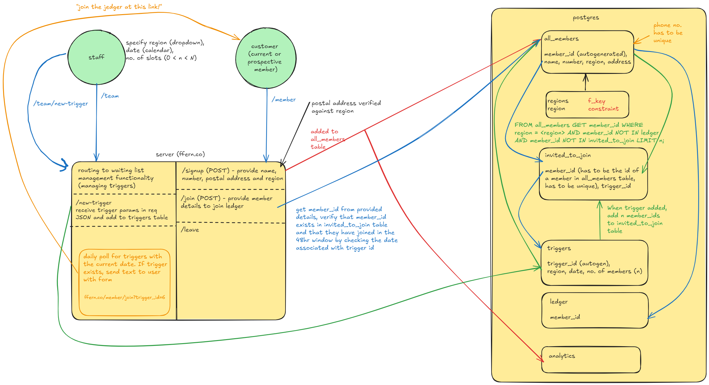

# Ffern Technical Test

Ffern is a subscription-based perfume business that implements a waitlist system to manage demand for new memberships.

This repo is a web application with functionality to sign up to a waiting list using a name and phone number. It is a membership waiting list. Staff users can release new invites that will be sent to people on the list, enabling them to become members. 
I implemented the waiting list, but did not have time to create the invite functionality. However, I have a clear plan for how I would implement it.

It uses React for the frontend, Next.js for the backend and connects to a PostgreSQL database hosted on Supabase. 

This project is bootstrapped with [`create-next-app`](https://github.com/vercel/next.js/tree/canary/packages/create-next-app).

## Architecture


## Getting Started

First, run the development server:

```bash
npm run dev
# or
yarn dev
# or
pnpm dev
# or
bun dev
```

Open [http://localhost:3000](http://localhost:3000) with your browser to see the result.

## Rowan's Thoughts

### Supabase Client and DAL (Data Access Layer)
- Put the Supabase database user's creds in the environment variables
- You have to asycnchronously authenticate each DB client, this makes building a nice DB client more difficult. You should not be instantiating the client layer on each client method call.
- I didn't end up implementing this, but I would make different DB clients for each level of authentication: public, members, team. Public would have INSERT permissions on the members table and nothing else, members would be able to UPDATE/DELETE on the members table, and add users to the ledger, team client would be able to INSERT on the triggers table etc.
- There is currently an issue with the supabase client throwing an error when I attempt to check if a member is in the ledger. It says the JWT has expired for the user immediately after signing in. This only appeared after a refactor.

### UI
- Need to implement form validation: password length, some regex to check valid telephone numbers.
- Wasn't aware of the useActionState hook and how it is possible to use server components to create a form rendered on the server.
- All of the state and callbacks are defined on the SignUp component to centralise state and logic
- If I were to do it again, i would redirect the user to a new page after a successful login. This would save data being sent to the user needlessly.

### Auth
- I started making the auth layer (storing hashed passwords with bcrypt) but didn't get around to finishing it. To finish it I would add:
    - Store an encrypted token on a session cookie. This will then exist on all subsequent client requests.
    - Decrypt the token from the session cookie. If successfully decrypted, expose make certain routes available. For example, the decrypted data might contain information about the user type (member or team), if it's a team user: allow routing to trigger creation.
    - Can add functionality for session persistence, like renewing the session cookie each time it is verified.

### Analytics
- Partially implemented them through the Vercel platform.

### DB
- I implemented some foreign key constraints like member region must match a value in the regions table, and that a member_id on the ledger must correspond to an id on the members table. I also included some cascades to remove users from the ledger if they opt out.
- In future, I would add some DB triggers for the adding users to the invited_to_join table. 

### Testing
- I would refactor the DAL to make it easier for testing, for example making it easier to inject a mock client that can return dummy data.
- React server components are apparently not fully supported by testing frameworks, so better to stick to end-to-end testing. This seems like a drawback. [SOURCE](https://nextjs.org/docs/app/building-your-application/testing#async-server-components)
- I didn't use TDD to make this because I have never used the Next framework before, so wanted to focus on getting something working.

### Requirements Coverage
Covered:
- I have met the component requirements (database, API endpoints and sign up page)
- 3/4 of technical requirements. I haven't authenticated all of the endpoints but have a clear plan for how I would do that.
- Opting out of the waiting list

Not Covered:
- Testing - why not?
- Don't store analytics data. However Vercel has a nice dashboard for traffic analytics that I have used.
- The trigger/invite process was never implemented.

